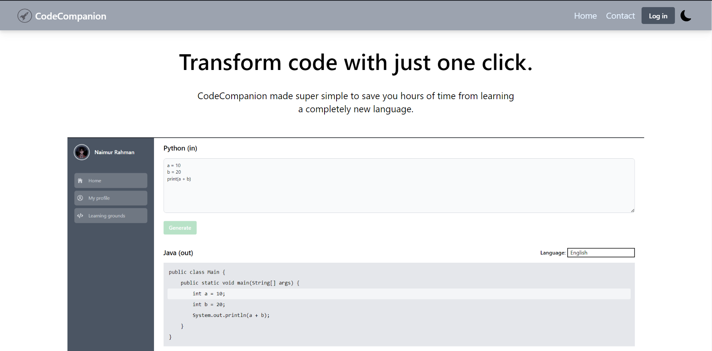
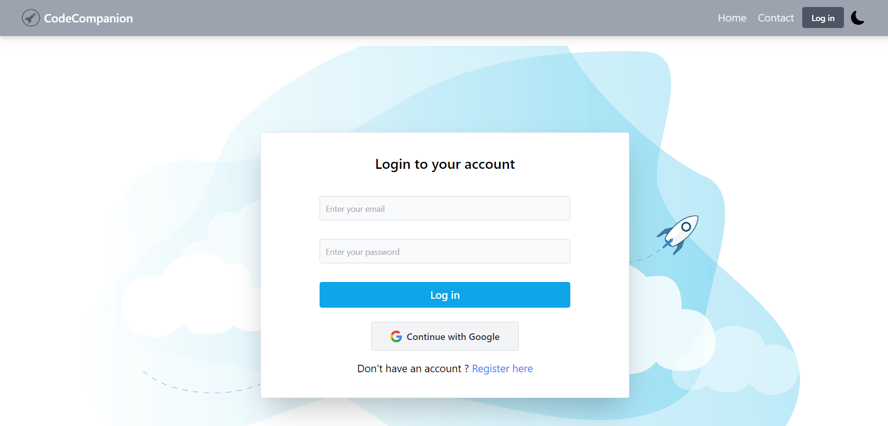
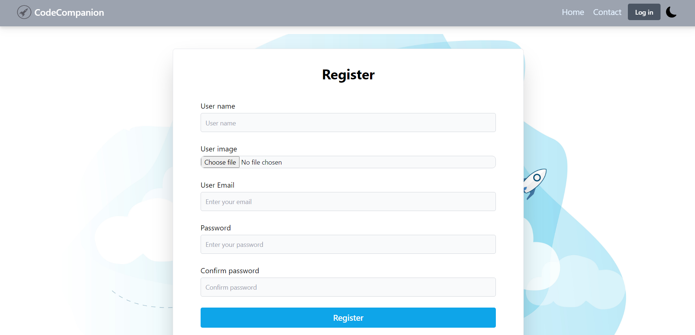
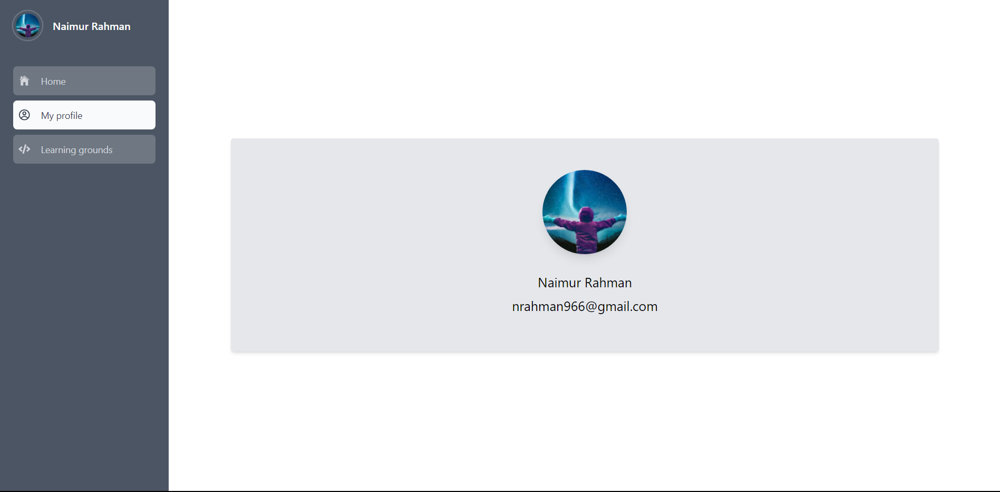
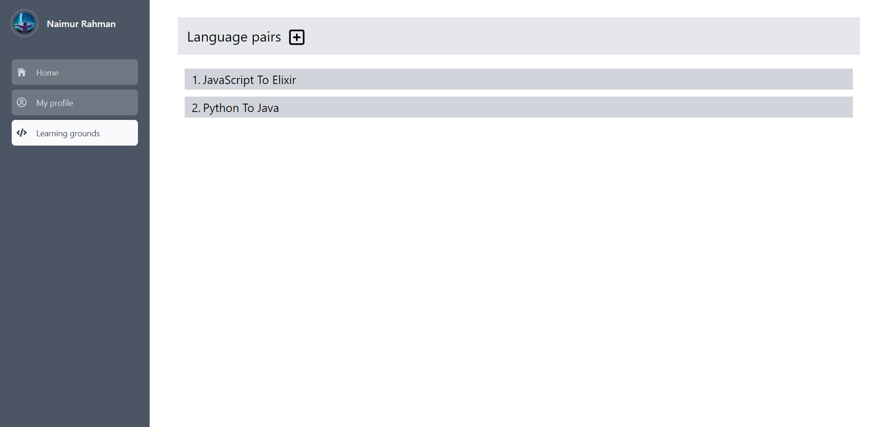
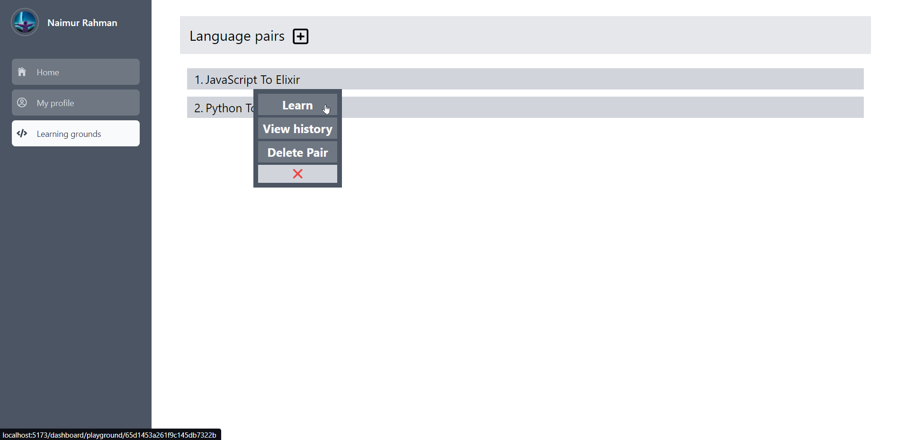
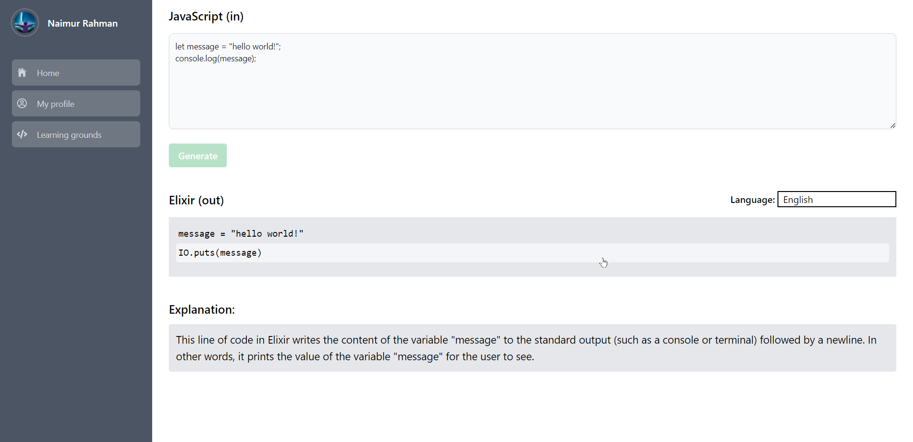
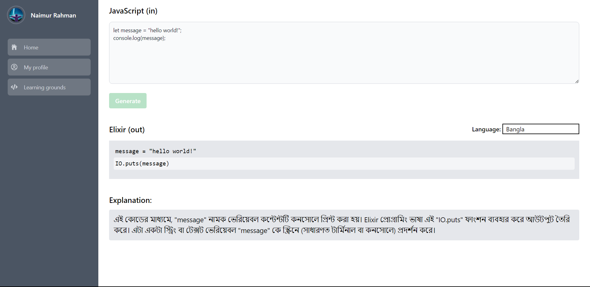
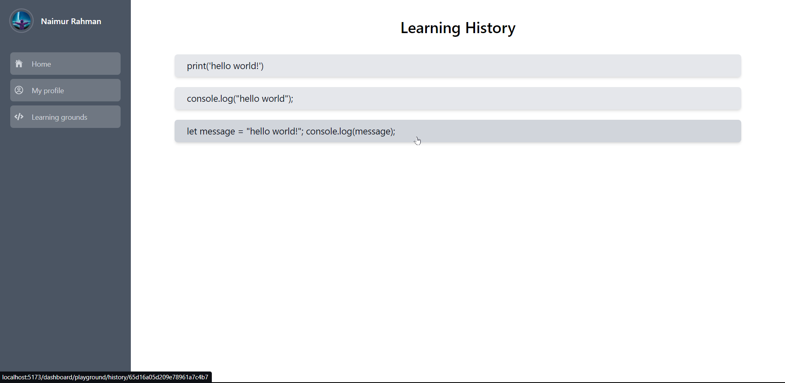

# SUST Hackathon: Code Companion



**AI-Powered Programming Language Learning Assistant (Code Companion)**

**Problem We're Solving:**
The Shatab team aims to tackle the steep learning curve associated with mastering programming languages, particularly for individuals who already possess proficiency in one or more languages. Our core concept revolves around simplifying the process of comparing and selecting new languages when you already have a foundation in one. While existing online code converters merely translate code, they fall short in facilitating genuine learning experiences.

**Code Companion: An Analogical Learning Approach!**

## Badges


## Acknowledgements

- [OpenAI API](https://openai.com/blog/openai-api/)

## Installation

Installation and running of this project to the local machine may vary the dependencies. You may follow the Installation process :

1. Copy the URL for the repository. To clone the repository using HTTPS, under "HTTPS", click. To clone the repository using an SSH key, including a certificate issued by your organization's SSH certificate authority, click SSH, then click.To clone a repository using GitHub CLI, click GitHub CLI, then click.

2. Open Git Bash.
3. Change the current working directory to the location where you want the cloned directory.
4. Clone the repository to your local machine using the following command:

```bash
  git clone https://github.com/naimur-29/SUST-Hackathon-2024
```

5. Press Enter to create your local clone.

6. Go to the project directory

```bash
  cd client
```

7. Install dependencies

```bash
  npm install
```

## Run Locally

move to client

```bash
  cd client
```

Checkout the Main Branch

```bash
  git checkout Main
```

Start the Server

```bash
  npm run dev
```

This will start the development server and it will be accessible at http://localhost:8000.
Port may vary from machine to machine.

## Environment Variables

To run this project, you will need to add the following environment variables to your .env file

`MONGODB_URI`

The `MONGODB_URI` represent the mongodb server uri.

`DB_NAME`

The `DB_NAME` represent the db name (you can choose any name).

`OPEN_AI_API_KEY`

The `OPEN_AI_API_KEY`, you must provide a OpenAi API key that supports GPT-4.

## To run the server

1. move to server

```bash
  cd server
```

2. install all dependencies

```bash
  npm install
```

3. set the environment variables in a .env file under the server/src/

4. finally run the server

```bash
  npm run live
```

## Screenshots

- Home page
  

- Login Page
  

- Registration Page
  

- Profile Page
  

- Learning Grounds
  

- Learn
  

- Dedicated Learning Ground
  

- Dedicated Learning Ground (Bengali)
  

- History Page
  

## Branches

**Main**

- Main branch is the most stable branch.
- The main brach contains both stable client and server integrations.

**Development**

- Acts like a shield protecting the main branch from merging vulnerabilities.

**Client**

- All the frontend related code are pushed here before merging.

**Server**

- The server-side API codes are branched out here.
- The connection between server and client has also been established here.

## API Reference

#### Retrieve MetaMask Wallet Address

```http
  GET /api/user/:uid
```

| Parameter | Type     | Description                                                                  |
| :-------- | :------- | :--------------------------------------------------------------------------- |
| `uid`     | `string` | **Required**. Without the unique user ID, user information can't be fetched! |

#### MetaMask Address Authentication

```http
  POST /api/user
```

| Parameter | Type   | Description                |
| :-------- | :----- | :------------------------- |
| `none`    | `none` | Route for adding new user. |

#### Ethereum API

```http
  GET /api/pair/:uid
```

| Parameter | Type     | Description                                               |
| :-------- | :------- | :-------------------------------------------------------- |
| `uid`     | `string` | **Required**. Returns the language pairs under that user. |

```http
  GET /api/pair/:uid/:_id
```

| Parameter  | Type     | Description                                                 |
| :--------- | :------- | :---------------------------------------------------------- |
| `uid, _id` | `string` | **Required**. Fetches one specific pair by their unique ID. |

```http
  POST /api/pair/
```

| Parameter | Type   | Description                           |
| :-------- | :----- | :------------------------------------ |
| `none`    | `none` | Route for adding a new language pair. |

```http
  DELETE /api/pair/:uid
```

| Parameter | Type     | Description                                         |
| :-------- | :------- | :-------------------------------------------------- |
| `uid`     | `string` | **Required**.Deletes all the pairs under that user. |

```http
  DELETE /api/pair/:uid/:_id
```

| Parameter  | Type     | Description                                        |
| :--------- | :------- | :------------------------------------------------- |
| `uid, _id` | `string` | **Required**.Deletes only the pair with that \_id. |

```http
  GET /api/history/:uid/:_id
```

| Parameter  | Type     | Description                                                                 |
| :--------- | :------- | :-------------------------------------------------------------------------- |
| `uid, _id` | `string` | **Required**.Fetches the history of that particular pair with uid and \_id. |

## Tech Stack

**Client:**

- [React](https://react.dev/)
- [Tailwind](https://tailwindcss.com/)

**Server:**

- [Express](https://expressjs.com/)
- [Node](https://nodejs.org/)
- [OpenAi API](https://platform.openai.com/)

## Tools

**IDE**

- [Visual Studio Code](https://marketplace.visualstudio.com/items?itemName=JuanBlanco.solidity)

## Authors

- [Naimur Rahman](https://github.com/naimur-29/)

- [Md. Moniruzzaman Billal](https://github.com/MoniruzzamanBillal/)

- [Md. Ashraful Haque](https://github.com/ashraful-21/)
